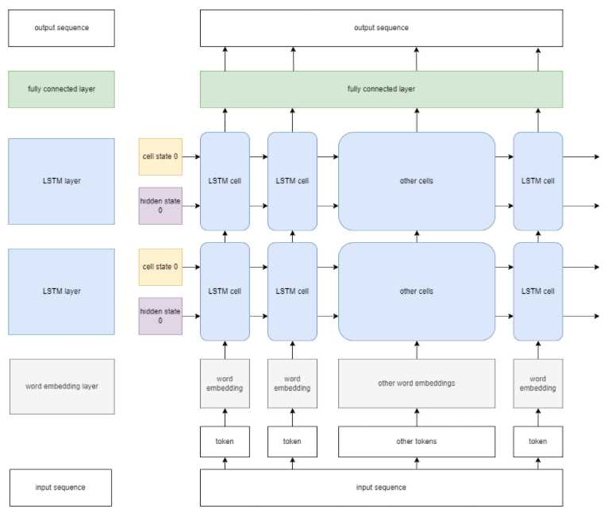
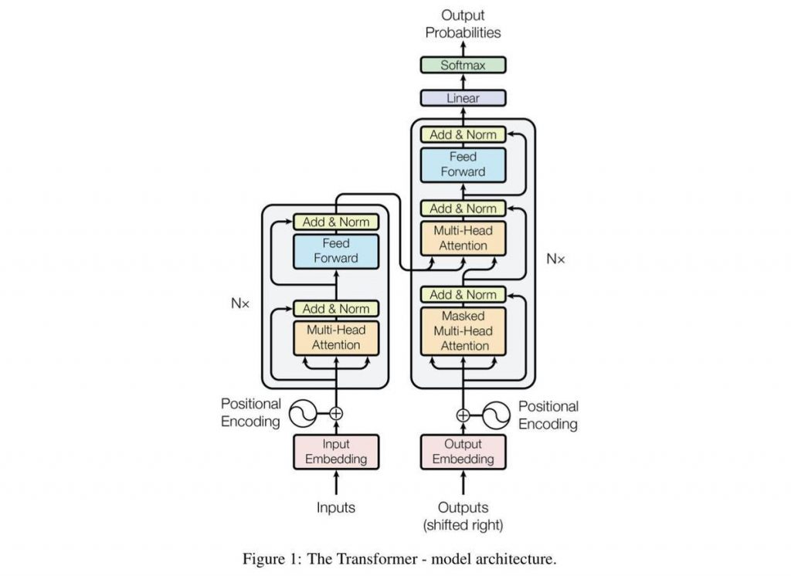

# HERORY - A Fairy Tale Story Generator

HERORY is a fairy tale story aims to generate fairy tale story based on a few texts inputted by the user.

This is a NLP project using PyTorch as ML framework.

## Models used in this project

The models used in this project are:
- [Unidirectional LSTM model](#model1)
- [GPT-Neo model](#model2)

### Unidirectional LSTM model

The unidirectional LSTM model is the main model used in this project. The structure of the model is:

Pipeline:
1. text sequence enter the word embedding layer of the model to learn the relationship between words (tokens)
2. output of word embedding enter the stacked LSTMs to learn the structure of the sentence
3. fully connected layer connects the output of LSTMs to generate the text

### GPT-Neo model

The GPT-Neo model used in this project is to compare with the LSTM model from HERORY.

Below is the structure of a simple transformer model to illustrate how the GPT model works.

GPT-Neo, a GPT model with GPT-3 architecture. GPT stands for Generative Pre-trained Transformer, which is a pre-trained transformer model. What makes GPT models so powerful is the attention mechanism, which in short let the model learns to pay attention to a position of a specific sentence, instead of paying attention to the previous closest words.

## Notebooks

Select the following notebooks to see the results:

- [HERORY - showcase](./showcase.ipynb)
- [HERORY - with training](./main.ipynb)